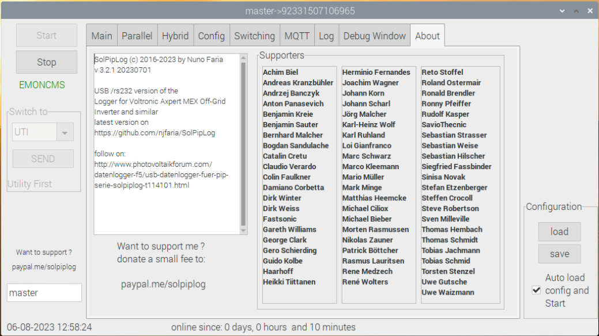
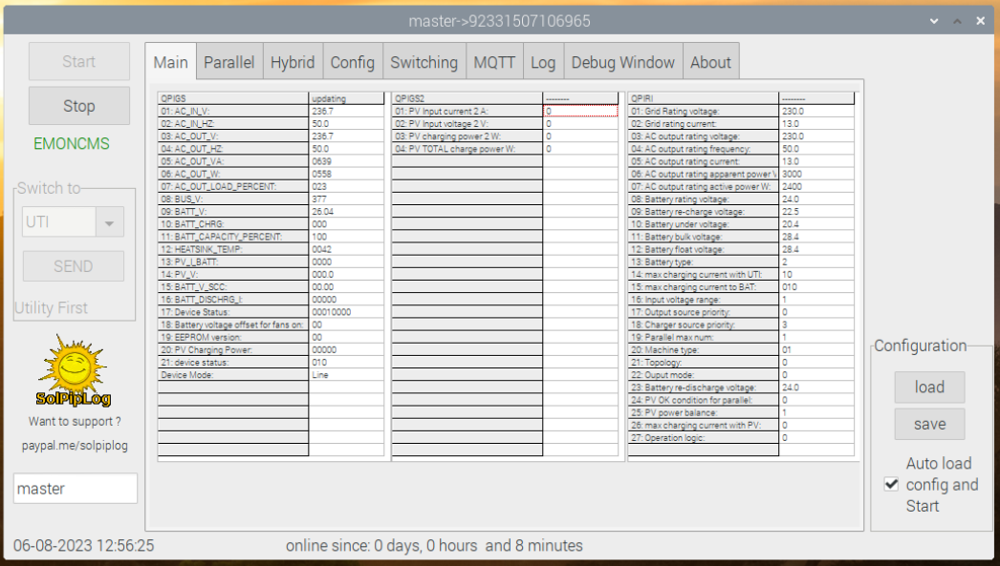

# SolPipLog 

**Logger for the PIP Inverter series ( USB + RS232 version) + BMV Battery Monitor** 
* Voltronic Axpert, Mppsolar PIP, Voltacon, Effekta, KING and other branded Oems
* Victron Battery Monitor BMV700 and BMV702 and BMV 712 Smart
* pylon valuess logging

* want to support me ? [support](https://paypal.me/solpiplog)

- working on Raspberry Pi2/Pi3/Pi4 version.
- sends data over MQTT
- change by time to grid or to batterie/solar
- change by time charge order
- change on SOC to grid or to batterie/solar
- logs data from BMV battery monitor to remote or local [Emoncms](https://emoncms.org) server
- logs data from Inverter to remote or local [Emoncms](https://emoncms.org) server
- logs MULTIPLE USB Inverter ( v. 2.3.0 and up )
- logs pylon batteries.

 Emoncms is an open-source web application for processing, logging and visualising energy, temperature and other environmental data and is part of the [OpenEnergyMonitor project](http://openenergymonitor.org).

- sends data to [PVOutput](http://www.pvoutput.org).

 PVOutput is a free service for sharing and comparing PV output data.

## Install
 * For **RASPBERRY** users. Copy folder **"sol"** to yout **"/home/pi"** directory. Execute "setup.sh" which is inside "sol" folder
 * make **solpiplog** executable with
   * **sudo chmod +x solpiplog** or 
   * change it with graphical interface inside of Raspberry. Right click on file - properties - permissions tab - tick execute allow excecuting file as program
   * problably you dont even need to do it, if i dont forget to make it executable :) 
 * create an account on [Emoncms](https://emoncms.org) or install **Emoncms** on your own server. 
 * optional: create an account on [PVOutput](http://www.pvoutput.org).
 * configure **SolPipLog** with your Emoncms API-Key
 * optional configure **SolPipLog** with your PVOutput SystemID and API-Key.
 * choose autoload config and start and press on Save ( if you restart SolPipLog it loads the config file and runs. )
   
## [Values sent to Emoncms when logging with node](/docs/emoncmsvaluesnode.md)

## [Values sent to Emoncms when logging with pip serialnumber/name](/docs/emoncmsvaluesserial.md)

## [Values sent to Emoncms when logging with BMV](/docs/emoncmsbmv.md)

## [Values sent over MQTT for Inverter and BMV ](/docs/mqttvalues.md)

## [Values sent over MQTT for pylon](/docs/mqttpylonvalues.md)

## [Version](/docs/version.md)

## Release
* [latest version](https://github.com/njfaria/SolPipLog/releases)

## Examples 
- [solar](http://solpiplog.eu)

## Image
- [image](https://ln2.sync.com/dl/bb7dfb190/d8tqu845-2hjw7brj-gtr5pd5r-bntskrb2)
image based on RASPBIAN Buster, RealVNC installed, Emoncms installed, MQTT installed
burn with etcher.io or similar software.
username:pi
password:solpiplog

follow on http://www.photovoltaikforum.com/datenlogger-f5/usb-datenlogger-fuer-pip-serie-solpiplog-t114101.html

## Appearance

 
